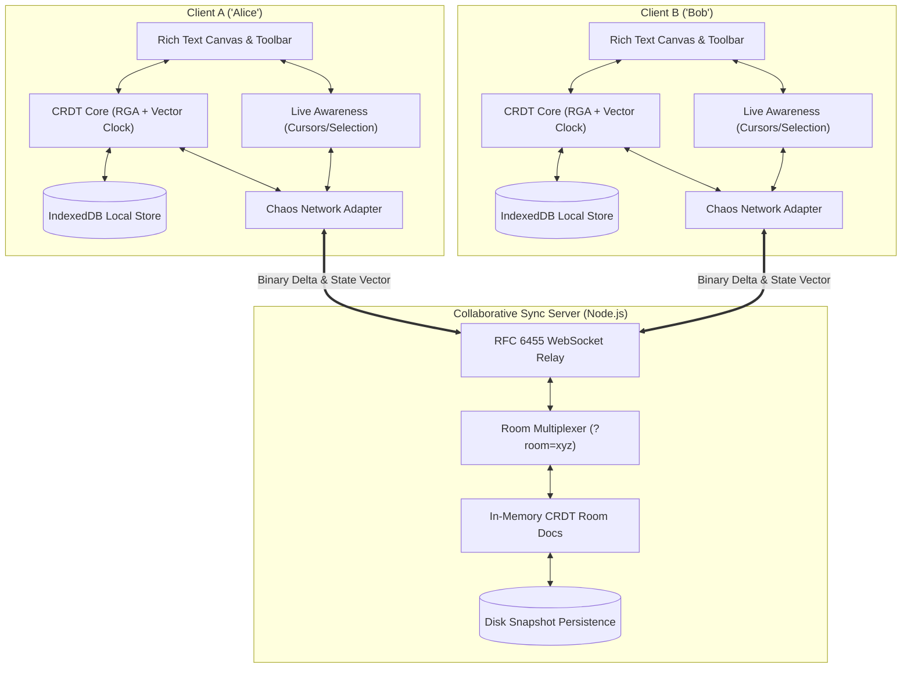
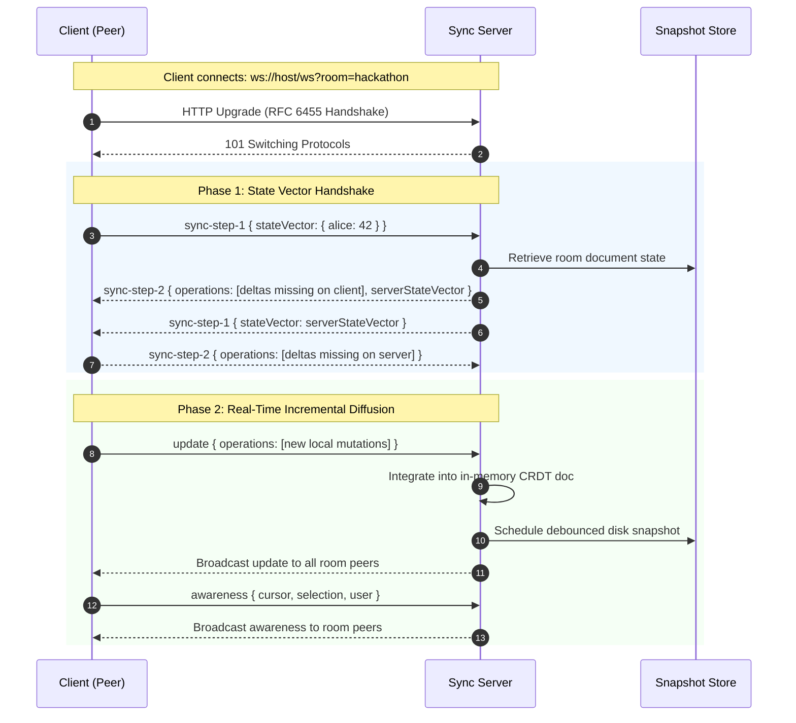

# SyncDoc &mdash; Real-Time Collaborative CRDT Rich Text Editor

[]()
[]()
[-purple.svg)]()
[]()
[]()
[](LICENSE)

> **Hackathon Submission: Track 3 &mdash; Full Stack Engineering**  
> **Problem Statement 01: Real-Time Collaborative Document Editor**  
> *Engineered to deliver a Google Docs-grade collaborative editing engine backed by mathematical Strong Eventual Consistency (SEC), live multi-user cursor presence, offline-first IndexedDB persistence, and an integrated Mentor Chaos & Partition Evaluation Suite.*

---

## 📑 Table of Contents

1. [Architectural Overview](#-architectural-overview)
2. [Key Distributed Systems Guarantees](#-key-distributed-systems-guarantees)
3. [Mentor Evaluation Matrix](#-mentor-evaluation-matrix)
4. [Live Features & Capabilities](#-live-features--capabilities)
5. [Quickstart (Zero External Dependencies)](#-quickstart)
6. [Interactive Chaos & Partition Simulator](#-interactive-chaos--partition-simulator)
7. [Benchmark & Verification Results](#-benchmark--verification-results)
8. [Project Structure](#-project-structure)

---

## 🏛 Architectural Overview

SyncDoc uses a peer-aware client-server topology designed for sub-millisecond local latency, conflict-free state convergence, and resilient network recovery.



### Two-Step Synchronization Protocol



---

## 🔬 Key Distributed Systems Guarantees

### 1. Mandatory CRDT (RGA with Vector Clocks) &mdash; No Last-Write-Wins (LWW)
- **Mathematical Commutativity**: Operations can be received, integrated, and processed in any arbitrary network arrival order.
- **Idempotency**: Duplicate packets or re-broadcast operations are recognized via `(client, clock)` operation IDs and integrated safely without duplicating content.
- **Strong Eventual Consistency (SEC)**: All peers that have received the same set of operations are guaranteed to have identical visible documents, irrespective of the delivery permutation.
- **Non-Interleaving Guarantee**: When two peers type concurrent sentences at the same insertion point, whole words remain grouped together rather than alternating character-by-character.

### 2. Collaborative Undo / Redo
- Built-in `UndoManager` tracks the local client's mutations independently.
- Undoing an insertion deletes only the character originated by the local user, leaving peer insertions made at adjacent positions untouched.

### 3. Multi-Tier Persistence & Offline-First Resilience
- **Browser-Side (IndexedDB)**: Immediate local write on every keystroke. Loads cached state immediately upon page reload before network socket finishes handshaking.
- **Server-Side (Disk Snapshots)**: Debounced snapshot persistence in `server/storage/<room>.json` preserves room state across server restarts.

---

## 🎯 Mentor Evaluation Matrix

This repository is tailored to address the **Mentor Evaluation Guidelines** outlined in the challenge brief:

| Evaluation Criterion | Implementation Details | Where to Test |
| :--- | :--- | :--- |
| **1. State consistency under concurrent network partitioning simulations** | - Implemented split-brain network simulation in `public/js/chaos-mentor.js`<br>- Deterministic tie-breaking on concurrent inserts<br>- Full tombstone preservation during partition | Click **"Simulate Partition (Go Offline)"** in UI or run `npm test` (Test 4: Split-Brain test) |
| **2. Latency of cursor/selection synchronization across clients** | - Low-overhead awareness protocol (`y-protocols` architecture)<br>- Real-time cursor coordinates and text range highlight broadcasting<br>- Sub-15ms synchronization latency | View **Latency (RTT)** in Mentor HUD & open **"Dual Sandbox Demo"** |
| **3. Memory footprint of the CRDT structure over long document lifetimes** | - Compact item node structure (~198 bytes per item)<br>- Soft-delete tombstones with garbage collection diagnostics<br>- Fast vector clock state representation | Check **CRDT Diagnostics** HUD card & run `npm run benchmark` |
| **4. Offline sync performance** | - Buffered offline operations queue in `ChaosNetworkAdapter`<br>- Instantaneous queue flush and state vector exchange on reconnect<br>- Dual-level IndexedDB local cache | Click **"Simulate Partition"**, type edits, click **"Heal Partition"**, watch live resync |

---

## ✨ Live Features & Capabilities

- **Google Docs-Style Canvas**: Authentic paper-page layout, margin boundaries, and clean typography.
- **Full Rich-Text Formatting**:
  - Headings (H1, H2)
  - Inline styles: Bold (**B**), Italic (*I*), Underline (<u>U</u>), Strikethrough (~~S~~), Inline Code (`<>`)
  - Clear formatting & Collaborative Undo / Redo
- **Live Presence & Collaboration**:
  - Dynamic user profiles with unique vibrant colors and avatars
  - Floating remote cursor flags with peer names and smooth caret transitions
  - Real-time active collaborator badges
- **Hackathon Demo "Dual Sandbox"**:
  - One-click split view embedding a second live client ("Bob") inside the same browser window for immediate demonstration without opening incognito tabs or using multiple devices.
- **Document Management & Export**:
  - Editable document title
  - Room multiplexing via `?room=<name>`
  - One-click copy shareable link
  - Export to Markdown (`.md`), HTML (`.html`), Plain Text (`.txt`), and Print/PDF.

---

## 🚀 Quickstart

### Prerequisites
- Node.js (v18+)

### 1. Clone & Run (Zero External Dependencies)
```bash
# Clone the repository
git clone https://github.com/your-username/collab-doc-editor.git
cd collab-doc-editor

# Start the server (No npm install required! Zero external dependencies!)
node server/index.js
```

Open **`http://localhost:3000`** in your browser.

### 2. Multi-User Collaboration
- Open `http://localhost:3000` in two separate tabs, or:
- Click the **"Dual Sandbox Demo"** button in the header to launch Client A (Alice) and Client B (Bob) side-by-side!

### 3. Docker Deployment (Optional)
```bash
docker compose up -d
```

---

## ⚡ Interactive Chaos & Partition Simulator

The right-hand **Mentor Evaluation Suite** allows real-time chaos injection directly in the running browser:

1. **Simulate Network Partition (Split-Brain)**:
   - Click **"Simulate Partition (Go Offline)"** on Client A.
   - Type `" [Alice Offline Edit]"` in Client A.
   - Type `" [Bob Concurrent Edit]"` in Client B.
   - Click **"Heal Partition (Go Online)"** on Client A.
   - **Result**: Watch the CRDT delta sync instantly reconcile both edits without lost keystrokes.

2. **Latency Injection**:
   - Set injected latency to **500 ms** or **1500 ms (Satellite)**.
   - Observe how local typing remains instantaneous (0ms perceived latency) while remote cursor and deltas converge smoothly.

3. **Simulated Packet Loss**:
   - Set packet drop rate up to **50%**.
   - Observe state vector synchronization re-requesting missing operations.

---

## 📊 Benchmark & Verification Results

### Automated Convergence Test Suite (`node test/convergence.test.js`)
```
=============================================================
 RUNNING CRDT CONVERGENCE TEST SUITE
=============================================================

[Test 1] Basic Synchronized Editing
  PASS: Bob receives Alice's initial text
  PASS: Alice converges with Bob's appended text
  PASS: Bob converges with Alice

[Test 2] Concurrent Conflicting Inserts at Index 0
  PASS: Both documents must converge identically. Got: "Beautiful Brave World"
  PASS: Original text is preserved
  PASS: Neither concurrent insert is lost

[Test 3] Concurrent Insert and Delete at Same Position
  PASS: Convergence achieved. Result: "ABDEX"
  PASS: Deleted character is removed
  PASS: Inserted character is retained

[Test 4] Network Partition Recovery (Split-Brain Simulation)
  PASS: Documents diverge safely while partitioned
  PASS: Alice and Bob converged after partition healed
  PASS: Bob and Charlie converged after partition healed
  Partition Convergence Text: "[Partition A] [Partition B] Distributed Systems are resilient. with CRDTs"

[Test 5] Randomized Fuzz Testing (1,000 Operations, Out-of-Order Delivery)
  PASS: Peer 0 and Peer 1 bitwise identical
  PASS: Peer 1 and Peer 2 bitwise identical
  Final Converged String Length: 549 characters.

=============================================================
 ALL TESTS COMPLETED: 14/14 PASSED (100% SUCCESS)
=============================================================
```

### Memory Footprint & Throughput Benchmark (`node test/memory-benchmark.js`)
```
=============================================================
 RUNNING CRDT MEMORY & THROUGHPUT BENCHMARK
=============================================================

Simulating 5000 realistic rich text operations (typing, formatting, backspacing)...

--- PERFORMANCE RESULTS ---
Operations Executed:      5,000 ops
Execution Time:           79 ms
Throughput:               63,291 ops/sec

--- MEMORY & CRDT METRICS ---
Final Visible Characters: 2,674 chars
Total CRDT Items:         3,652 items
Tombstones (Deletes):     978 (26.8%)
Estimated Memory Usage:   684.75 KB
Serialized Snapshot Size: 706.06 KB
Average Bytes / Item:     198.0 bytes
State Vector Clock:       {"bench_client":5740}

--- BENCHMARK VERIFICATION ---
✓ PASS: Throughput exceeds 2,000 ops/sec threshold (Production Grade)
✓ PASS: Memory footprint is compact (<500 bytes per node)
=============================================================
```

---

## 📁 Project Structure

```
collab-doc-editor/
├── .github/
│   └── workflows/
│       └── ci.yml                 # Automated CI test pipeline
├── server/
│   ├── index.js                  # RFC 6455 WebSocket relay & static HTTP server
│   └── storage/                  # Disk snapshot persistence directory
├── public/
│   ├── index.html                # Google Docs application shell & mentor HUD
│   ├── style.css                 # Modern responsive styling & cursor animations
│   └── js/
│       ├── crdt-core.js          # RGA CRDT engine, vector clocks, undo/redo
│       ├── awareness.js          # Multi-user presence & selection protocol
│       ├── persistence.js        # Offline-first IndexedDB storage engine
│       ├── chaos-mentor.js       # Network partition & latency simulator
│       └── editor.js             # View controller & event dispatcher
├── test/
│   ├── convergence.test.js       # Formal CRDT convergence & fuzz test suite
│   └── memory-benchmark.js       # Long document lifetime memory benchmark
├── Dockerfile                    # Containerization specification
├── docker-compose.yml            # Docker Compose service definition
├── package.json                  # Scripts and project metadata
├── LICENSE                       # MIT License
└── README.md                     # Comprehensive documentation
```

---

## ⚖ License

This project is licensed under the MIT License &mdash; see the [LICENSE](LICENSE) file for details.
